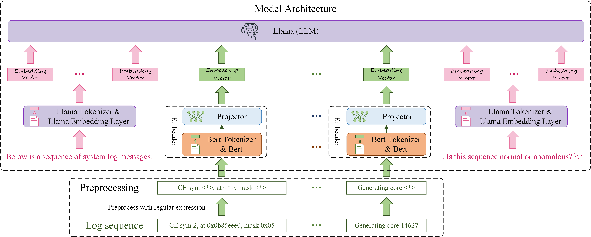

# LogLLM: Log-based Anomaly Detection Using Large Language Models #

Official Implementation of "LogLLM: Log-based Anomaly Detection Using Large Language Models"


## Datasets

The statistics of datasets used in the experiments.

|             |                    |                     |    Training Data    |  Training Data  |   Training Data   |    Testing Data     |  Testing Data   |   Testing Data    |
|:-----------:|:------------------:|:-------------------:|:-------------------:|:---------------:|:-----------------:|:-------------------:|:---------------:|:-----------------:|
|             | **# Log Messages** | **# Log Sequences** | **# Log Sequences** | **# Anomalies** | **Anomaly Ratio** | **# Log Sequences** | **# Anomalies** | **Anomaly Ratio** |
|    HDFS     |     11,175,629     |       575,061       |       460,048       |      13497      |       2.93%       |       115013        |      3341       |       2.90%       |
|     BGL     |     4,747,963      |       47,135        |       37,708        |      4009       |      10.63%       |        9427         |       817       |       8.67%       |
|   Liberty   |     5,000,000      |       50,000        |        40000        |      34144      |      85.36%       |        10000        |       651       |       6.51%       |
| Thunderbird |     10,000,000     |       99,997        |       79,997        |       837       |       1.05%       |        20000        |       29        |       0.15%       |

## Experiment Results

Experimental Results on HDFS, BGL, Liberty, and Thunderbird datasets. The best results are indicated using bold
typeface.

|            |                |   HDFS    |   HDFS    |   HDFS    |    BGL    |    BGL    |    BGL    |  Liberty  |  Liberty  |  Liberty  | Thunderbird | Thunderbird | Thunderbird |             |
|:----------:|:--------------:|:---------:|:---------:|:---------:|:---------:|:---------:|:---------:|:---------:|:---------:|:---------:|:-----------:|:-----------:|:-----------:|:-----------:|
|            | **Log Parser** | **Prec.** | **Rec.**  |  **F1**   | **Prec.** | **Rec.**  |  **F1**   | **Prec.** | **Rec.**  |  **F1**   |  **Prec.**  |  **Rec.**   |   **F1**    | **Avg. F1** |
|  DeepLog   |    &#10004;    |   0.835   |   0.994   |   0.908   |   0.166   |   0.988   |   0.285   |   0.751   |   0.855   |   0.800   |    0.017    |    0.966    |    0.033    |    0.506    |
| LogAnomaly |    &#10004;    |   0.886   |   0.893   |   0.966   |   0.176   |   0.985   |   0.299   |   0.684   |   0.876   |   0.768   |    0.025    |    0.966    |    0.050    |    0.521    |
|   PLELog   |    &#10004;    |   0.893   |   0.979   |   0.934   |   0.595   |   0.880   |   0.710   |   0.795   |   0.874   |   0.832   |    0.808    |    0.724    |    0.764    |    0.810    |
| FastLogAD  |    &#10004;    |   0.721   |   0.893   |   0.798   |   0.167   | **1.000** |   0.287   |   0.151   | **0.999** |   0.263   |    0.008    |    0.931    |    0.017    |    0.341    |
|  LogBERT   |    &#10004;    |   0.989   |   0.614   |   0.758   |   0.165   |   0.989   |   0.283   |   0.902   |   0.633   |   0.744   |    0.022    |    0.172    |    0.039    |    0.456    |
| LogRobust  |    &#10004;    |   0.961   |   1.000   |   0.980   |   0.696   |   0.968   |   0.810   |   0.695   |   0.979   |   0.813   |    0.318    |  **1.000**  |    0.482    |    0.771    |
|    CNN     |    &#10004;    |   0.966   |   1.000   |   0.982   |   0.698   |   0.965   |   0.810   |   0.580   |   0.914   |   0.709   |    0.870    |    0.690    |    0.769    |    0.818    |
| NeuralLog  |    &#10008;    |   0.971   |   0.988   |   0.979   |   0.792   |   0.884   |   0.835   |   0.875   |   0.926   |   0.900   |    0.794    |    0.931    |    0.857    |    0.893    |
|   RAPID    |    &#10008;    | **1.000** |   0.859   |   0.924   | **0.874** |   0.399   |   0.548   |   0.911   |   0.611   |   0.732   |    0.200    |    0.207    |    0.203    |    0.602    |
|   LogLLM   |    &#10008;    |   0.994   | **1.000** | **0.997** |   0.861   |   0.979   | **0.916** | **0.992** |   0.926   | **0.958** |  **0.966**  |    0.966    |  **0.966**  |  **0.959**  |

---

## Setup

You can manage dependencies with either **uv** (recommended — faster, lockfile-based, used in this fork) or **conda** (original method from the paper). Pick one.

### Option 1 — uv (recommended)

```bash
# 1. Install uv (one-time)
curl -LsSf https://astral.sh/uv/install.sh | sh

# 2. Sync the environment (creates .venv from pyproject.toml + uv.lock)
uv sync
```

Then prefix any Python command with `uv run`:
```bash
uv run python train.py
```

### Option 2 — conda (original)

Requirements from the paper: Python 3.8.20, CUDA 12.1.

```bash
conda create -n logllm python=3.8
conda activate logllm
pip install torch==2.4.0 torchvision==0.19.0 torchaudio==2.4.0 \
    --index-url https://download.pytorch.org/whl/cu121
pip install transformers datasets peft accelerate bitsandbytes \
    safetensors scikit-learn tqdm huggingface_hub python-dotenv
```

> `requirements.txt` is a conda-format export from the original env (not pip-compatible). uv users should use `pyproject.toml` instead.

In the rest of this README, commands are shown with the `uv run` prefix. If you're using conda, drop the `uv run` part (run with plain `python ...` inside the activated env).

---

## HuggingFace Authentication

`meta-llama/Meta-Llama-3-8B` is a **gated repo** — request access at
https://huggingface.co/meta-llama/Meta-Llama-3-8B before downloading.

Provide your HF token in one of these ways:

```bash
# Option A: .env file (recommended for project-local setup)
cp .env.example .env
# then edit .env and paste your token into HF_TOKEN=

# Option B: HuggingFace CLI (machine-wide)
hf auth login
```

Get a token at https://huggingface.co/settings/tokens (Read scope is enough).

---

## Download Base Models

You need BERT + Meta-Llama-3-8B (~16 GB total — matches the paper). Use the helper script:

```bash
uv run python scripts/download_models.py
```

This downloads to `models/`:
- `google-bert/bert-base-uncased` → `models/bert-base-uncased`
- `meta-llama/Meta-Llama-3-8B` → `models/Meta-Llama-3-8B`

Optional flags:

| Flag | Description |
|---|---|
| `--bert <repo>` | Override BERT repo (default: `google-bert/bert-base-uncased`) |
| `--llama <repo>` | Override Llama repo (default: `meta-llama/Meta-Llama-3-8B`) |
| `--skip-bert` | Skip BERT download |
| `--skip-llama` | Skip Llama download |

If you change the Llama repo, also update `Llama_path` in `train.py` and `eval.py` to match the new folder name.

---

## Prepare Data

### BGL — automated

```bash
# Download & extract BGL.log into ./data/
uv run python scripts/download_bgl.py

# Generate train.csv / test.csv via fixed-size sessions
uv run python -m prepareData.sliding_window
```

To train on only a slice of the log (faster experiments), set `start_line` / `end_line` in [prepareData/sliding_window.py](prepareData/sliding_window.py) before running step 2.

### Thunderbird / Liberty — manual

- Get the raw log file from [logpai/loghub](https://github.com/logpai/loghub) (Liberty: [Rackspace HPC4 mirror](http://0b4af6cdc2f0c5998459-c0245c5c937c5dedcca3f1764ecc9b2f.r43.cf2.rackcdn.com/hpc4/liberty2.gz)).
- Edit `data_dir`, `log_name` in [prepareData/sliding_window.py](prepareData/sliding_window.py):
  ```python
  data_dir = './data'
  log_name = 'Thunderbird.log'   # or 'liberty.log'
  ```
- For **Liberty**, activate `start_line = 40000000`, `end_line = 45000000`.
- For **Thunderbird**, activate `start_line = 160000000`, `end_line = 170000000`.
- Run from project root: `uv run python -m prepareData.sliding_window`.

> Author-provided test sets:
> [BGL test](https://drive.google.com/file/d/1aMKzhrLklnk5RX78UBc3Zx3voIIGnQzo/view) ·
> [Liberty test](https://drive.google.com/file/d/1-Z2FrsRSm8ojfOW1555obNyU6B_aRDTH/view)

### HDFS

The original `session_window.py` script has been removed in this fork (focused on BGL). To process HDFS, restore it from upstream history.

---

## Train

Paths in [train.py](train.py) are pre-configured for this fork's layout:
```python
dataset_name = 'BGL'                          # or 'Thunderbird', 'Liberty'
data_path    = './data/train.csv'
Bert_path    = './models/bert-base-uncased'
Llama_path   = './models/Meta-Llama-3-8B'     # match what you downloaded
```

Then:
```bash
uv run python train.py
```

The fine-tuned LoRA adapters + Bert weights + projector are saved to `ft_model_<dataset_name>/`.

> Training has 4 phases: train Llama → train projector → train projector + Bert → fine-tune everything. Adjust epoch counts at the top of `train.py` if needed.

### Run in background with tmux (recommended for long runs)

Training takes hours — run it inside a `tmux` session so it survives SSH disconnects.

```bash
# 1. Create a tmux session named "train"
tmux new -s train

# 2. Inside tmux, run training (capture logs to a file too)
uv run python train.py 2>&1 | tee train.log

# 3. Detach without stopping: press  Ctrl+b  then  d
#    (training keeps running in the background)

# 4. Re-attach later
tmux attach -t train

# 5. List sessions
tmux ls

# 6. Kill the session when done
tmux kill-session -t train
```

Useful tmux keybindings (all start with the prefix `Ctrl+b`):

| Keys | Action |
|---|---|
| `Ctrl+b` `d` | Detach (keep session running) |
| `Ctrl+b` `%` | Split pane vertically |
| `Ctrl+b` `"` | Split pane horizontally |
| `Ctrl+b` `←/→/↑/↓` | Move between panes |
| `Ctrl+b` `[` | Scroll mode (press `q` to exit) |

Tip: in a second pane, monitor GPU usage live:
```bash
watch -n 2 nvidia-smi
```

---

## Evaluate

Make sure `Llama_path` in [eval.py](eval.py) matches the **base model used for training** — adapters are tied to a specific base.

```bash
uv run python eval.py
```

Prints precision / recall / F1 / accuracy on the test set.

> The repo ships with the authors' pre-trained adapters in `ft_model_<dataset_name>/`. These were trained on `meta-llama/Meta-Llama-3-8B` — to reproduce the paper numbers, download that base model (not 3.1) and skip the Train step.
